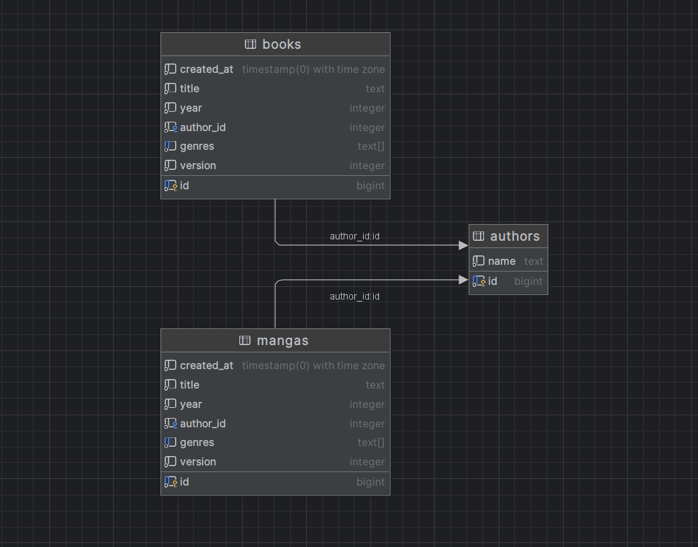

# Library App

## Getting Started

To get started with using the Library App, follow the steps below:

### Prerequisites

- Go programming language installed on your system.
- PostgreSQL database installed and running.

### Installation

1. Clone the repository:

   ```
   git clone <repository-url>
   ```

2. Install dependencies:

   ```
   go mod tidy
   ```

3. Build the project:

   ```
   go build
   ```

### Running the Server

Run the server using the following command:

```
go run .
```

## API Endpoints

The following endpoints are available in the API:

### Authors

- `POST /v1/authors`: Add a new author.
- `GET /v1/authors`: Get all authors.
- `GET /v1/authors/{author_id}`: Get a author by ID.
- `PUT /v1/authors/{author_id}`: Update a author by ID.
- `DELETE /v1/authors/{author_id}`: Delete a author by ID.

### Books

- `POST /v1/books`: Add a new book.
- `GET /v1/books`: Get all books.
- `GET /v1/books/{book_id}`: Get a book by ID.
- `PUT /v1/books/{book_id}`: Update a book by ID.
- `DELETE /v1/books/{book_id}`: Delete a book by ID.

### Manga

- `POST /v1/manga`: Add a new manga.
- `GET /v1/manga`: Get all manga.
- `GET /v1/manga/{manga_id}`: Get a manga by ID.
- `PUT /v1/manga/{manga_id}`: Update a manga by ID.
- `DELETE /v1/manga/{manga_id}`: Delete a manga by ID.

### Manga and Books

- `GET /v1/authors/{author_id}/books`: Get all books by a author.
- `GET /v1/authors/{author_id}/manga`: Get all manga by a author.

## DB structure

```
CREATE TABLE IF NOT EXISTS authors (
                                     id bigserial PRIMARY KEY,
                                     name text NOT NULL
);
```
```
CREATE TABLE IF NOT EXISTS books (
                                     id bigserial PRIMARY KEY,
                                     created_at timestamp(0) with time zone NOT NULL DEFAULT NOW(),
                                     title text NOT NULL,
                                     year integer NOT NULL,
                                     author_id integer NOT NULL,
                                     genres text[] NOT NULL,
                                     version integer NOT NULL DEFAULT 1,
                                     FOREIGN KEY (author_id) REFERENCES authors(id)
);
```
```
CREATE TABLE IF NOT EXISTS mangas (
                                     id bigserial PRIMARY KEY,
                                     created_at timestamp(0) with time zone NOT NULL DEFAULT NOW(),
                                     title text NOT NULL,
                                     year integer NOT NULL,
                                     year integer NOT NULL,
                                     author_id integer NOT NULL,
                                     genres text[] NOT NULL,
                                     version integer NOT NULL DEFAULT 1,
                                     FOREIGN KEY (author_id) REFERENCES authors(id)
);
```

## Database Schema



---
